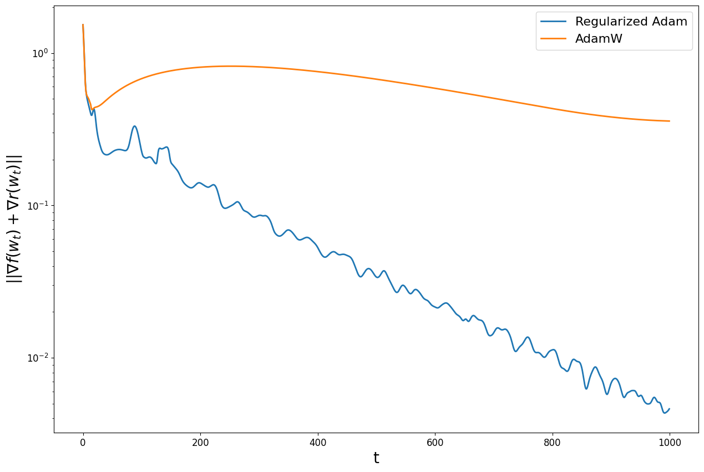
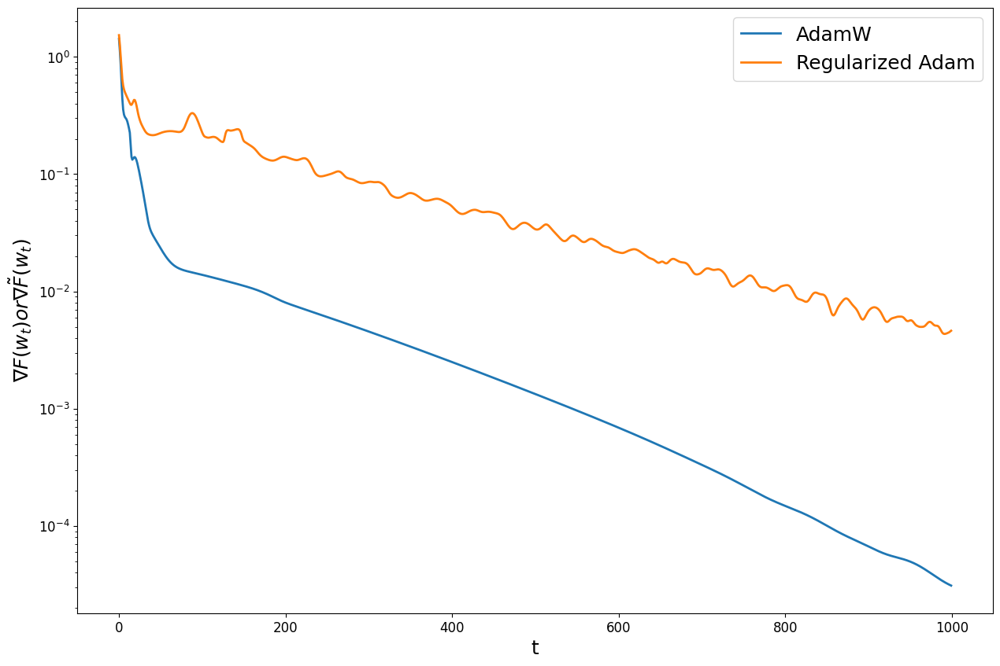

| Name of the problem under study | On methods with preconditioning and weight decaying |
| :---: | :---: |
| Type of scientific work | Bachelor's Diploma |
| Author | Kreinin Matvei Vadimovich |
| Scientific director | Ph.D. Alexander Beznosikov |

# Description

This paper investigates the convergence behavior of optimization methods with preconditioning
that utilize weight decay regularization, specifically focusing on popular variants such as AdamW and
OASIS. We explore different alternatives to these method, with the goal of investigating their convergence
speed and accuracy. Also we conduct experiments on benchmark datasets and models in order to compare
them on practice. Overall, our study provides insights into the design of regularization techniques methods
with preconditioning.

# Installation

1. `git clone` this repository.
2. Create new `conda` environment and activate it
3. Run 

```bash
pip install -r requirements.txt
pip install ipykernel
python -m ipykernel install --user --name <env_name> --display-name <env_name>
```

# Content
This repository provides code for reproducing experiments that were performed as part of scientific work in the fall semester of 2023.
If you run AdamVarious.ipynb in the mush_src directory, you will reproduce the experimental results obtained in the article. Namely, the difference in the rate of convergence for preconditioned methods. Also in optim_fancy.py Experiments on working with optimization methods with preconditioning and coordinate-wise are presented. You can run experemines.ipynb to reproduce the results about the dependence of the distribution of weights in different layers in a convolutional neural network for optimization methods with preconditioning and weight decaying.



